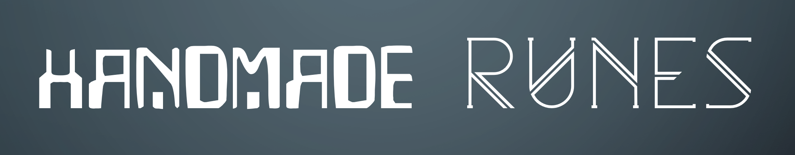

    
     
    Graphics programming from scratch in the Odin programming language 
     

This is a series is about coding interactive applications that renders 2D and 3D graphics using Odin. 
All coding is video recorded, ans is available to watch on <b>[YouTube](https://www.youtube.com/channel/UClyTX7-I5WH-L3RPCzbmqEw/playlists)</b>. 
This repo included the the code of each session in the series. 
Coding is done <i>"Handmade"</i> style, inspired by the [Handmade Hero project](https://hero.handmade.network/). 
 
